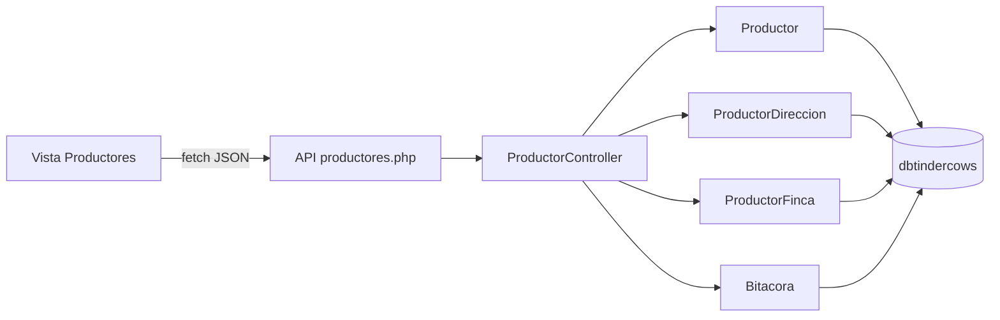

# Diagrama de aplicación

```mermaid
flowchart LR
    V[Vista Productores] -->|fetch JSON| A[API productores.php]
    A --> C[ProductorController]
    C --> P[Productor]
    C --> D[ProductorDireccion]
    C --> F[ProductorFinca]
    C --> B[Bitacora]
    P --> DB[(dbtindercows)]
    D --> DB
    F --> DB
    B --> DB
```

El controlador valida y abre una transacción. Los cuatro modelos solo ejecutan
SQL preparado. La respuesta siempre usa el contrato JSON de dominio.
