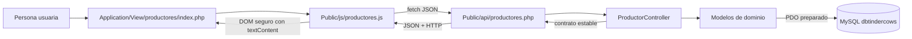
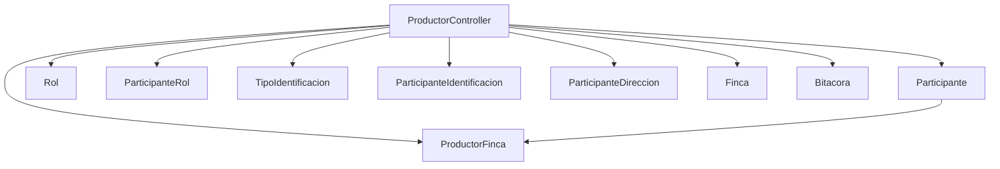
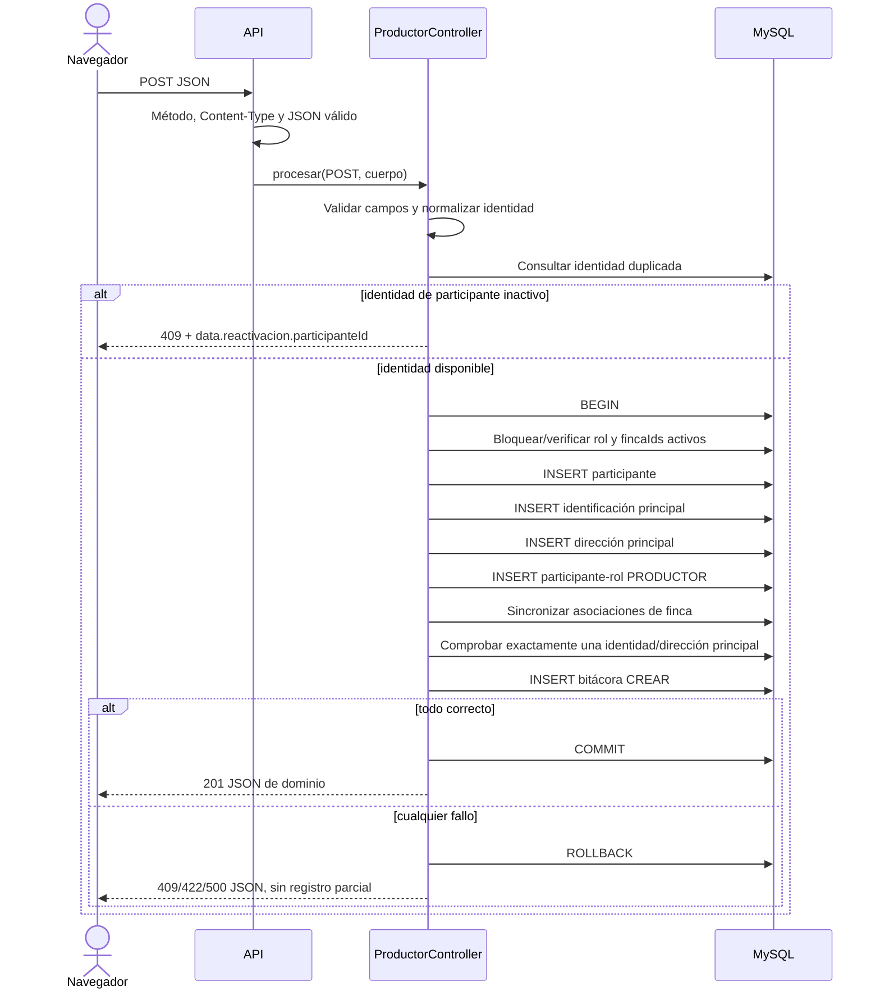
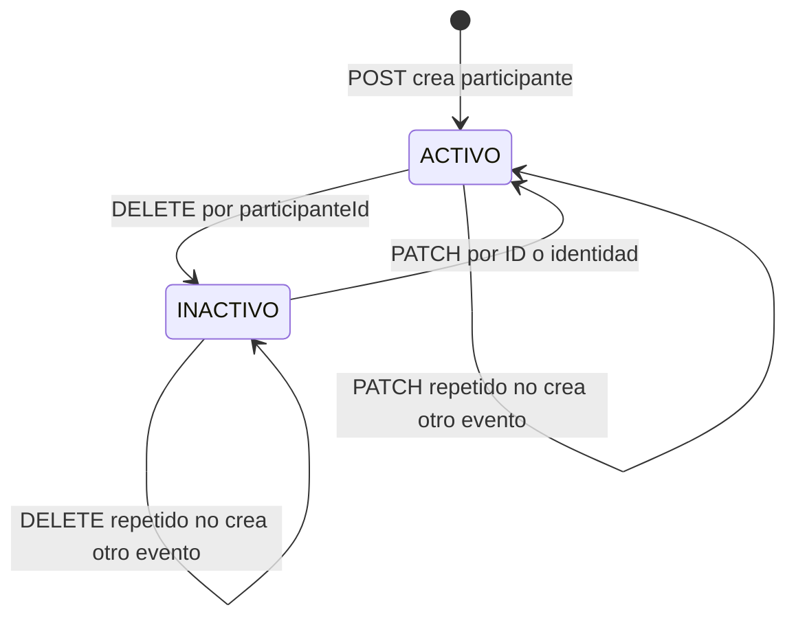

# Diagrama de aplicación y flujo transaccional

## Responsabilidad por capa

| Componente | Hace | No hace |
|---|---|---|
| Vista | Presenta formulario, tabla, estados y accesibilidad. | SQL o reglas de unicidad. |
| JavaScript | Captura eventos, construye JSON, usa `fetch`, bloquea doble envío y actualiza DOM sin recarga. | Persistencia, credenciales o validación final. |
| Endpoint | Comprueba método y `Content-Type`, lee JSON una vez, construye dependencias y envía siempre JSON. | Reglas del dominio o HTML. |
| `ProductorController` | Valida estructura, coordina transacción, traduce errores a HTTP y mapea el contrato. | SQL directo en la vista. |
| Modelos | Ejecutan consultas preparadas y mapean filas. | Generar HTML. |
| MySQL | Aplica PK, FK, UK, `CHECK`, índices y atomicidad. | Inventar la política de negocio que no cabe en una restricción. |

## Dependencias de dominio

`Participante` devuelve datos de dominio y no nombres físicos `tb...`:
`participanteId`, rol, identificación, nombre, teléfono, correo, estado,
dirección principal y fincas.

## Flujo de creación

La consulta previa mejora el mensaje. La restricción única sobre tipo y número
normalizado es la garantía final ante dos solicitudes concurrentes.

## Flujo de actualización

1. Validar el objeto completo y `participanteId`.
2. `BEGIN` y bloquear `tbparticipante` con `FOR UPDATE`.
3. Confirmar existencia, estado activo y rol `PRODUCTOR` mediante la lectura de
   dominio.
4. Confirmar que la identificación no pertenece a otra persona.
5. Bloquear todas las fincas solicitadas y comprobar que estén activas.
6. Actualizar contacto, identificación principal y dirección principal.
7. Sincronizar asociaciones: reactivar/agregar las solicitadas y desactivar las
   retiradas, sin borrar filas.
8. Comprobar las dos políticas de principal única.
9. Registrar `ACTUALIZAR` con datos anteriores y nuevos.
10. `COMMIT`; cualquier excepción ejecuta `ROLLBACK`.

## Desactivación y reactivación

La implementación conserva identificación, dirección, roles y fincas al
desactivar. Para reactivar exige que el mismo participante conserve rol
`PRODUCTOR`, identificación principal y dirección principal válidos. No crea una
segunda persona.

## Fronteras de consistencia y fallos

- La transacción pertenece a `ProductorController` porque una operación coordina
  varios modelos.
- La bitácora se escribe dentro de la transacción. Un `ROLLBACK` no deja una
  falsa operación exitosa.
- PK y FK impiden referencias inexistentes y borrado físico accidental de filas
  relacionadas.
- UK impide identidad, rol o asociación duplicados.
- Las columnas generadas impiden dos principales activas.
- La aplicación verifica que exista exactamente una principal activa.
- Un error inesperado se registra con `error_log`; la respuesta pública es un
  JSON genérico `500`.
- `tbbitacoraRegistroId` es una referencia lógica polimórfica, sin FK física.
  En este módulo la entidad registrada es `PARTICIPANTE`.

## Códigos HTTP

| Código | Situación |
|---:|---|
| `200` | Consulta, actualización, desactivación o reactivación correctas. |
| `201` | Productor creado. |
| `204` | `OPTIONS`. |
| `400` | Cuerpo vacío, JSON inválido o raíz que no es objeto. |
| `404` | Productor no encontrado. |
| `405` | Método no permitido. |
| `409` | Identidad reservada/duplicada, inactivo no actualizable o política de dominio incumplida. |
| `415` | Cuerpo sin `application/json`. |
| `422` | Campo, filtro, catálogo, finca o referencia inválida. |
| `500` | Falla inesperada sin detalles internos. |
