# DER - Productor núcleo y capacidades de persona

```mermaid
erDiagram
    tbpersona {
        INT tbpersonaid
        VARCHAR tbpersonaidentificacionnumero
        VARCHAR tbpersonaidentificaciontipo
        VARCHAR tbpersonanombre
        VARCHAR tbpersonatelefono
        VARCHAR tbpersonacorreoelectronico
        TINYINT tbpersonaestado
    }
    tbproductor { INT tbproductorid INT tbpersonaid }
    tbcomprador { INT tbcompradorid INT tbpersonaid TINYINT tbcompradorestado }
    tbtransportista { INT tbtransportistaid INT tbpersonaid TINYINT tbtransportistaestado }
    tbproductordireccion { INT tbproductordireccionid INT tbproductorid INT tbdireccionid DATETIME tbproductordireccionfechainicio DATETIME tbproductordireccionfechafin }
    tbdireccion { INT tbdireccionid VARCHAR tbdireccionprovincia VARCHAR tbdireccioncanton VARCHAR tbdirecciondistrito VARCHAR tbdireccionpueblo VARCHAR tbdireccionsenas }
    tbfinca { INT tbfincaid INT tbproductorid VARCHAR tbfincanombre TINYINT tbfincaestado }
    tbfincadireccion { INT tbfincadireccionid INT tbfincaid INT tbdireccionid }
    tbpagometodo { INT tbpagometodoid VARCHAR tbpagometodonombre VARCHAR tbpagometododescripcion TINYINT tbpagometodoactivo }
    tbvehiculo { INT tbvehiculoid VARCHAR tbvehiculoplaca VARCHAR tbvehiculovin VARCHAR tbvehiculomodelo TINYINT tbvehiculoestado }
    tbtransportistavehiculo { INT tbtransportistavehiculoid INT tbtransportistaid INT tbvehiculoid }
    tbproductorestadoperiodo { INT tbproductorestadoperiodoid INT tbproductorid TINYINT tbproductorestadoperiodoestado DATETIME tbproductorestadoperiodofechainicio DATETIME tbproductorestadoperiodofechafin VARCHAR tbproductorestadoperiodomotivo }
    tbproductorubicacion { INT tbproductorubicacionid INT tbproductorid DECIMAL tbproductorubicacionlatitud DECIMAL tbproductorubicacionlongitud DECIMAL tbproductorubicacionprecision DATETIME tbproductorubicacionfecha VARCHAR tbproductorubicacionorigen }
    tbproductoractividad { INT tbproductoractividadid INT tbproductorid VARCHAR tbproductoractividadtipo DATETIME tbproductoractividadfecha VARCHAR tbproductoractividadorigen }
    tbproductorclasificacionperiodo { INT tbproductorclasificacionperiodoid INT tbproductorid VARCHAR tbproductorclasificacionperiodotipo DATETIME tbproductorclasificacionperiodofechainicio DATETIME tbproductorclasificacionperiodofechafin VARCHAR tbproductorclasificacionperiodomotivo }
    tbanimal { INT tbanimalid VARCHAR tbanimalidentificacion VARCHAR tbanimalsexo VARCHAR tbanimalraza VARCHAR tbanimalcaracteristicas DATETIME tbanimalfecharegistroensistema VARCHAR tbanimalorigenregistro }
    tbanimalproduccionsalud { INT tbanimalproduccionsaludid INT tbanimalid DATETIME tbanimalproduccionsaludfecha VARCHAR tbanimalproduccionsaludorigen VARCHAR tbanimalproduccionsaludcontexto INT tbanimalproduccionsaludedadmeses DECIMAL tbanimalproduccionsaludpeso VARCHAR tbanimalproduccionsaludproposito VARCHAR tbanimalproduccionsaludestadoreproductivo INT tbanimalproduccionsaludpartos DECIMAL tbanimalproduccionsaludlitrosleche JSON tbanimalproduccionsaludproduccion JSON tbanimalproduccionsaludsalud }
    tbanimalpublicacion { INT tbanimalpublicacionid INT tbanimalid INT tbproductorvendedorid INT tbfincaid DATETIME tbanimalpublicacionfecha DECIMAL tbanimalpublicacionprecio VARCHAR tbanimalpublicaciontitulo VARCHAR tbanimalpublicaciondescripcion VARCHAR tbanimalpublicacionorigen }
    tbanimalpublicacionestadoperiodo { INT tbanimalpublicacionestadoperiodoid INT tbanimalpublicacionid VARCHAR tbanimalpublicacionestadoperiodoestado DATETIME tbanimalpublicacionestadoperiodofechainicio DATETIME tbanimalpublicacionestadoperiodofechafin VARCHAR tbanimalpublicacionestadoperiodomotivo VARCHAR tbanimalpublicacionestadoperiodoorigen }
    tbcompra { INT tbcompraid INT tbanimalid INT tbproductorcompradorid INT tbfincaorigenid DATE tbcomprafecha TIME tbcomprahora VARCHAR tbcompralugar DECIMAL tbcompraprecio INT tbpagometodoid VARCHAR tbcompraorigen }
    tbventa { INT tbventaid INT tbanimalid INT tbproductorvendedorid INT tbproductorcompradorid INT tbfincaid INT tbcompraid DATE tbventafecha TIME tbventahora VARCHAR tbventalugar INT tbventadireccionid VARCHAR tbventaproposito DECIMAL tbventaprecio INT tbpagometodoid INT tbventaedadmeses DECIMAL tbventapeso VARCHAR tbventarazasnapshot VARCHAR tbventaorigen }
    tbanimalinteraccion { INT tbanimalinteraccionid INT tbproductorid INT tbanimalid VARCHAR tbanimalinteracciontipo VARCHAR tbanimalinteraccionaccion DATETIME tbanimalinteraccionfecha VARCHAR tbanimalinteraccionorigen }
    tbcarrito { INT tbcarritoid INT tbproductorid DATETIME tbcarritofechacreacion }
    tbcarritoestadoperiodo { INT tbcarritoestadoperiodoid INT tbcarritoid VARCHAR tbcarritoestadoperiodoestado DATETIME tbcarritoestadoperiodofechainicio DATETIME tbcarritoestadoperiodofechafin VARCHAR tbcarritoestadoperiodomotivo VARCHAR tbcarritoestadoperiodoorigen }
    tbcarritoanimal { INT tbcarritoanimalid INT tbcarritoid INT tbanimalid VARCHAR tbcarritoanimalaccion DATETIME tbcarritoanimalfecha VARCHAR tbcarritoanimalorigen }
    tbtransportistaestadoperiodo { INT tbtransportistaestadoperiodoid INT tbtransportistaid TINYINT tbtransportistaestadoperiodoestado DATETIME tbtransportistaestadoperiodofechainicio DATETIME tbtransportistaestadoperiodofechafin VARCHAR tbtransportistaestadoperiodomotivo DATETIME tbtransportistaestadoperiodofecharegistroensistema }
    tbtransportistaflete { INT tbtransportistafleteid INT tbtransportistaid INT tbproductororigenid INT tbfincaorigenid INT tbdireccionorigenid INT tbdirecciondestinoid INT tbvehiculoid DATE tbtransportistafletefecha TIME tbtransportistafletehora VARCHAR tbtransportistafletedescripcion INT tbtransportistafletecantidadcabezas DECIMAL tbtransportistafletedistanciakm DECIMAL tbtransportistafleteprecio INT tbpagometodoid VARCHAR tbtransportistafleteorigen }
    tbtransportistahorario { INT tbtransportistahorarioid INT tbtransportistaid VARCHAR tbtransportistahorariodiasemana TIME tbtransportistahorariohorainicio TIME tbtransportistahorariohorafin DATETIME tbtransportistahorariofechainicio DATETIME tbtransportistahorariofechafin VARCHAR tbtransportistahorarioorigen }
    tbtransportistaresena { INT tbtransportistaresenaid INT tbtransportistaid INT tbpersonaid INT tbtransportistafleteid DATETIME tbtransportistaresenafecha INT tbtransportistaresenacalificacion VARCHAR tbtransportistaresenacomentario VARCHAR tbtransportistaresenaorigen }
    tbbitacora { BIGINT tbbitacoraid VARCHAR tbbitacoraentidad VARCHAR tbbitacoraregistroidentificacionnumero VARCHAR tbbitacoraaccion DATETIME tbbitacorafecha JSON tbbitacoradatosanteriores JSON tbbitacoradatosnuevos VARCHAR tbbitacoraactortipo BIGINT tbbitacorausuarioid VARCHAR tbbitacoraorigen VARCHAR tbbitacorasolicitudid }

    tbpersona ||--o| tbproductor : "capacidad por tbpersonaid"
    tbpersona ||--o| tbcomprador : "legacy por tbpersonaid"
    tbpersona ||--o| tbtransportista : "capacidad por tbpersonaid"
    tbproductor ||--|| tbproductordireccion : "residencia"
    tbproductordireccion }o--|| tbdireccion : "ubicacion"
    tbproductor ||--o{ tbfinca : "fincas"
    tbfinca ||--|| tbfincadireccion : "direccion"
    tbfincadireccion }o--|| tbdireccion : "ubicacion"
    tbtransportista ||--o{ tbtransportistavehiculo : "vehiculos"
    tbtransportistavehiculo }o--|| tbvehiculo : "vehiculo"
    tbproductor ||--o{ tbproductorestadoperiodo : "historico de estado"
    tbproductor ||--o{ tbproductorubicacion : "ubicaciones"
    tbproductor ||--o{ tbproductoractividad : "actividad"
    tbproductor ||--o{ tbproductorclasificacionperiodo : "comprador/vendedor"
    tbanimal ||--o{ tbanimalproduccionsalud : "observaciones"
    tbanimal ||--o{ tbanimalpublicacion : "publicaciones"
    tbproductor ||--o{ tbanimalpublicacion : "vendedor congelado"
    tbfinca ||--o{ tbanimalpublicacion : "finca congelada"
    tbanimal ||--o{ tbcompra : "compras"
    tbanimal ||--o{ tbventa : "ventas"
    tbproductor ||--o{ tbcompra : "comprador del momento"
    tbproductor ||--o{ tbventa : "vendedor/comprador del momento"
    tbpagometodo ||--o{ tbcompra : "metodo usado"
    tbpagometodo ||--o{ tbventa : "metodo usado"
    tbproductor ||--o{ tbanimalinteraccion : "funnel"
    tbanimal ||--o{ tbanimalinteraccion : "funnel"
    tbproductor ||--o{ tbcarrito : "carritos"
    tbcarrito ||--o{ tbcarritoanimal : "historial"
    tbanimal ||--o{ tbcarritoanimal : "carrito"
    tbtransportista ||--o{ tbtransportistaestadoperiodo : "historico estado"
    tbtransportista ||--o{ tbtransportistaflete : "fletes"
    tbtransportista ||--o{ tbtransportistaresena : "resenas"
    tbtransportista ||--o{ tbtransportistahorario : "horarios"
    tbanimalpublicacion ||--o{ tbanimalpublicacionestadoperiodo : "estados"
    tbcarrito ||--o{ tbcarritoestadoperiodo : "estados"
    tbvehiculo ||--o{ tbtransportistaflete : "vehiculo usado"
    tbpersona ||--o{ tbtransportistaresena : "autor"
```



## Identidad y capacidades

`tbpersona` es la fuente única de identificación, tipo, nombre, teléfono,
correo y disponibilidad global. `tbproductor` es la entidad de negocio núcleo.
Comprador y Vendedor no son tablas de entidad: son periodos independientes en
`tbproductorclasificacionperiodo`, con `tipo = COMPRADOR` o `VENDEDOR`.
`tbcomprador` es legacy de compatibilidad temporal mientras Backend dependa de
ella: no se amplía, no tiene tabla de periodos propia y debe retirarse.

El estado efectivo se calcula en PHP:

```text
capacidad efectiva = tbpersonaestado activo Y perfil.estado activo
```

Desactivar un perfil no afecta los otros. Desactivar `tbpersona` vuelve
inoperantes las capacidades actuales. `DELETE` de las APIs desactiva únicamente
el perfil y `PATCH` únicamente lo reactiva, siempre que la persona esté activa.

## Relaciones y política física

El modelo contiene exactamente 30 tablas. Las líneas del DER son relaciones
conceptuales usadas por PHP. MySQL y PostgreSQL no declaran PK, FK, UNIQUE,
CHECK, índices, ENUM, valores DEFAULT, AUTO_INCREMENT, triggers, rutinas ni
eventos. En términos del contrato docente: el esquema mantiene cero claves y
cero restricciones, índices u objetos programables. PHP garantiza IDs,
unicidad, coherencia, transacciones y bloqueos.

`tbproductordireccion` y `tbfincadireccion` solo enlazan ubicaciones de
`tbdireccion`. `tbproductorubicacion` conserva posiciones GPS append-only y no
reemplaza la residencia editable. Los IDs de perfiles y todas las relaciones
existentes permanecen iguales durante la migración.

`tbanimal` guarda identidad estable del animal. Peso, edad, producción y salud
se guardan como observaciones en `tbanimalproduccionsalud`. `tbanimalpublicacion`,
`tbcompra` y `tbventa` congelan los productores, finca, método de pago y datos
del hecho para reconstruir operaciones sin depender de relaciones futuras.
`tbanimalinteraccion`, `tbcarrito` y `tbcarritoanimal` cubren el funnel
especializado confirmado. Transporte agrega estado histórico, fletes y reseñas;
cantidad semanal, método frecuente y promedio se derivan con consultas.
