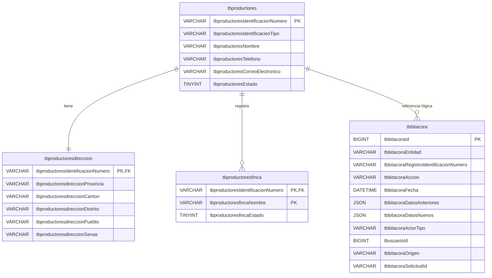

# DER — Modelo simplificado de productores

La dirección es obligatoria 1:1. Las fincas son 0:N. La línea de bitácora es
lógica y no una FK para conservar el historial independientemente del dominio.
