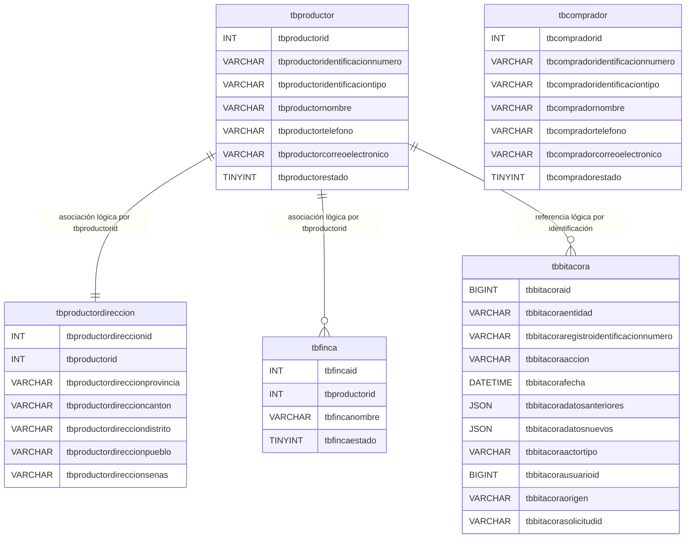

# DER - Modelo docente sin restricciones

Las líneas muestran asociaciones usadas por PHP, no restricciones de MySQL.
`tbcomprador` es independiente y todavía no participa en el CRUD de
productores.
El esquema define cero claves, restricciones, índices, valores `DEFAULT`,
`AUTO_INCREMENT` y objetos programables. PHP calcula cada identificador
mediante `MAX(id) + 1` bajo un bloqueo nombrado y envía todos los valores con
sentencias preparadas.
