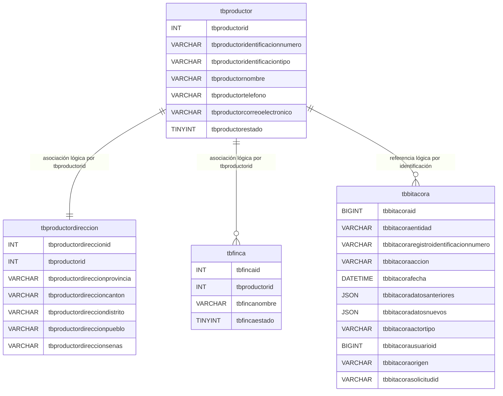

# DER - Modelo docente sin restricciones

Las líneas muestran asociaciones usadas por PHP, no restricciones de MySQL.
El esquema define cero claves, restricciones, índices y `AUTO_INCREMENT`. PHP
calcula cada identificador mediante `MAX(id) + 1` bajo un bloqueo nombrado.
