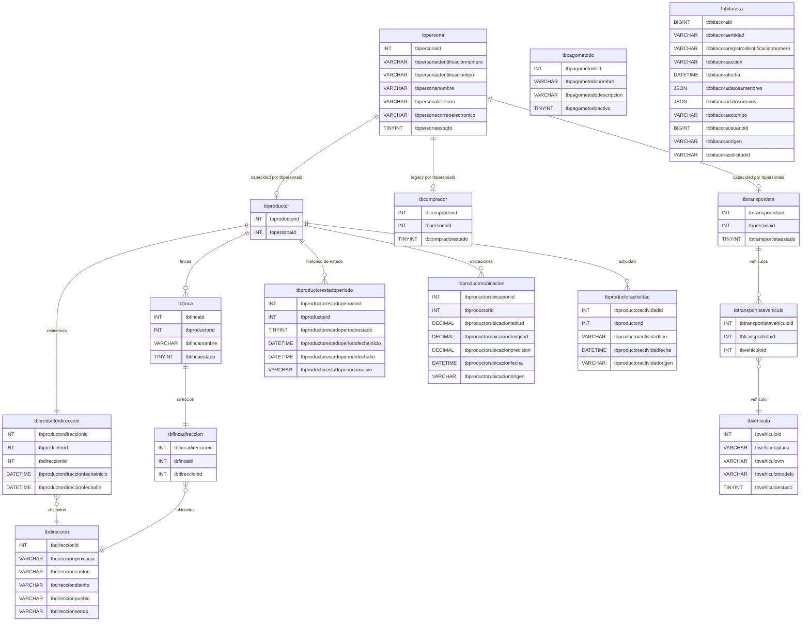

# DER - Productor núcleo y compatibilidad legacy



## Identidad, capacidades y legacy

`tbpersona` es la fuente única de identificación, tipo, nombre, teléfono,
correo y disponibilidad global. `tbproductor` y `tbtransportista` conservan sus
IDs operativos y solo contienen el enlace `tbpersonaid` y su estado de
participación. `tbcomprador` se conserva como estructura legacy; P0-C define
que Comprador y Vendedor son clasificaciones históricas derivadas del
Productor.

El estado efectivo se calcula en PHP:

```text
capacidad efectiva = tbpersonaestado activo Y perfil.estado activo
```

Desactivar un perfil no afecta los otros. Desactivar `tbpersona` vuelve
inoperantes las capacidades actuales. `DELETE` de las APIs desactiva únicamente
el perfil y `PATCH` únicamente lo reactiva, siempre que la persona esté activa.

## Relaciones y política física

El modelo contiene exactamente 15 tablas. Las líneas del DER son relaciones
conceptuales usadas por PHP. MySQL y PostgreSQL no declaran PK, FK, UNIQUE,
CHECK, índices, ENUM, valores DEFAULT, AUTO_INCREMENT, triggers, rutinas ni
eventos. En términos del contrato docente: el esquema mantiene cero claves y
cero restricciones, índices u objetos programables. PHP garantiza IDs,
unicidad, coherencia, transacciones y bloqueos.

`tbproductordireccion` y `tbfincadireccion` solo enlazan ubicaciones de
`tbdireccion`. `tbproductorubicacion` conserva posiciones GPS append-only y no
reemplaza la residencia editable. Los IDs de perfiles y todas las relaciones
existentes permanecen iguales durante la migración.
