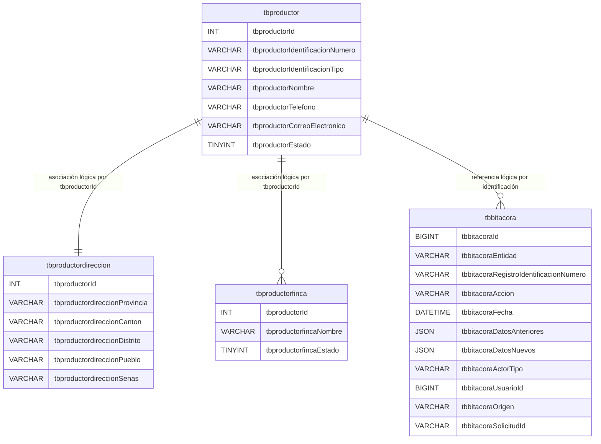

# DER - Modelo docente sin restricciones

Las líneas muestran asociaciones usadas por PHP, no restricciones de MySQL.
El esquema define cero `PRIMARY KEY`, cero `FOREIGN KEY` y cero `CHECK`.
`tbproductorId` es `INT NOT NULL`, no es clave y no usa `AUTO_INCREMENT`; PHP
calcula el siguiente valor bajo un bloqueo de alta. `tbbitacoraId` conserva
`AUTO_INCREMENT` mediante un índice ordinario no único.
