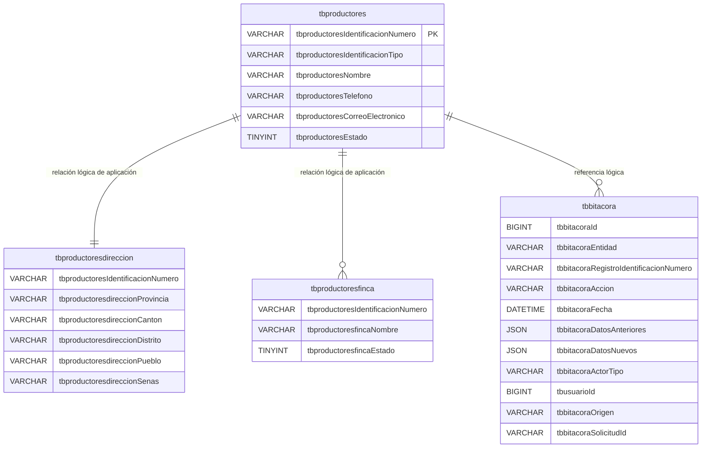

# DER - Modelo simplificado de productores

La única PRIMARY KEY es
`tbproductores.tbproductoresIdentificacionNumero`. Dirección, finca y bitácora
no tienen PRIMARY KEY. El esquema no contiene ninguna FOREIGN KEY. Las líneas
del diagrama representan cardinalidades lógicas controladas por la aplicación,
no restricciones referenciales de MySQL.

`tbbitacoraId` conserva `AUTO_INCREMENT` mediante un índice ordinario no único;
ese índice no es una PRIMARY KEY ni una FOREIGN KEY.
