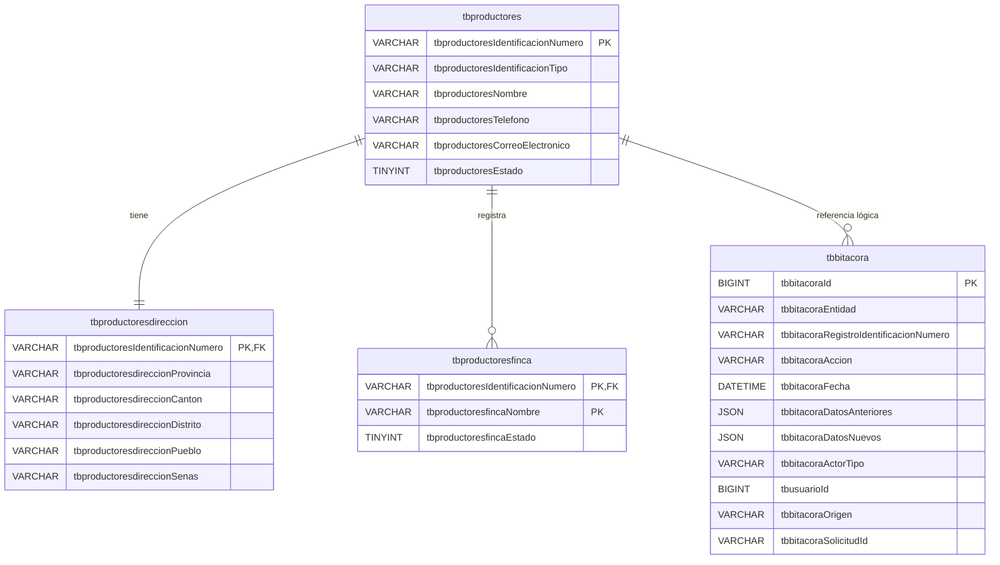

# DER — Modelo simplificado de productores

En `tbproductoresfinca`, ambas columnas marcadas `PK` forman una única PRIMARY
KEY compuesta. La dirección es obligatoria 1:1 por la transacción de la
aplicación; la PK/FK compartida impide más de una dirección y evita huérfanos.
Las fincas son 0:N. La línea de bitácora es una referencia lógica, no una FK,
para conservar el historial. Las FK de dirección y finca aplican
`ON UPDATE RESTRICT` y `ON DELETE RESTRICT`.
