# DER - Persona, contextos de negocio e históricos

> Estado vigente de `dev` para Avance 2. Las relaciones mostradas son conceptuales: MySQL no declara PK, FK, UNIQUE, CHECK, AUTO_INCREMENT, índices ni lógica programable. PHP valida relaciones, genera IDs y controla transacciones.

```mermaid
erDiagram
    tbpersona {
        INT tbpersonaid
        VARCHAR tbpersonaidentificacionnumero
        VARCHAR tbpersonaidentificaciontipo
        VARCHAR tbpersonanombre
        VARCHAR tbpersonaalias
        VARCHAR tbpersonatelefono
        VARCHAR tbpersonacorreoelectronico
        TINYINT tbpersonaestado
    }

    tbproductor {
        INT tbproductorid
        INT tbpersonaid
    }

    tbcomprador {
        INT tbcompradorid
        INT tbpersonaid
        TINYINT tbcompradorestado
    }

    tbtransportista {
        INT tbtransportistaid
        INT tbpersonaid
        TINYINT tbtransportistaestado
    }

    tbproductorpersonatelefonohistorico {
        INT tbproductorpersonatelefonohistoricoid
        INT tbproductorid
        VARCHAR tbproductorpersonatelefonohistoriconuevo
        DATETIME tbproductorpersonatelefonohistoricofecha
    }

    tbcompradorpersonatelefonohistorico {
        INT tbcompradorpersonatelefonohistoricoid
        INT tbcompradorid
        VARCHAR tbcompradorpersonatelefonohistoriconuevo
        DATETIME tbcompradorpersonatelefonohistoricofecha
    }

    tbproductordireccion {
        INT tbproductordireccionid
        INT tbproductorid
        INT tbdireccionid
        DATETIME tbproductordireccionfechainicio
        DATETIME tbproductordireccionfechafin
    }

    tbdireccion {
        INT tbdireccionid
        VARCHAR tbdireccionprovincia
        VARCHAR tbdireccioncanton
        VARCHAR tbdirecciondistrito
        VARCHAR tbdireccionpueblo
        VARCHAR tbdireccionsenas
    }

    tbfinca {
        INT tbfincaid
        INT tbproductorid
        VARCHAR tbfincanombre
        TINYINT tbfincaestado
    }

    tbfincadireccion {
        INT tbfincadireccionid
        INT tbfincaid
        INT tbdireccionid
    }

    tbproductorestadoperiodo {
        INT tbproductorestadoperiodoid
        INT tbproductorid
        TINYINT tbproductorestadoperiodoestado
        DATETIME tbproductorestadoperiodofechainicio
        DATETIME tbproductorestadoperiodofechafin
        VARCHAR tbproductorestadoperiodomotivo
    }

    tbproductorubicacion {
        INT tbproductorubicacionid
        INT tbproductorid
        DECIMAL tbproductorubicacionlatitud
        DECIMAL tbproductorubicacionlongitud
        DECIMAL tbproductorubicacionprecision
        DATETIME tbproductorubicacionfecha
        VARCHAR tbproductorubicacionorigen
    }

    tbproductoractividad {
        INT tbproductoractividadid
        INT tbproductorid
        VARCHAR tbproductoractividadtipo
        DATETIME tbproductoractividadfecha
        VARCHAR tbproductoractividadorigen
    }

    tbproductorclasificacionperiodo {
        INT tbproductorclasificacionperiodoid
        INT tbproductorid
        VARCHAR tbproductorclasificacionperiodotipo
        DATETIME tbproductorclasificacionperiodofechainicio
        DATETIME tbproductorclasificacionperiodofechafin
        VARCHAR tbproductorclasificacionperiodomotivo
    }

    tbpagometodo {
        INT tbpagometodoid
        VARCHAR tbpagometodonombre
        VARCHAR tbpagometododescripcion
        TINYINT tbpagometodoactivo
    }

    tbvehiculo {
        INT tbvehiculoid
        VARCHAR tbvehiculoplaca
        VARCHAR tbvehiculovin
        VARCHAR tbvehiculomodelo
        TINYINT tbvehiculoestado
    }

    tbtransportistavehiculo {
        INT tbtransportistavehiculoid
        INT tbtransportistaid
        INT tbvehiculoid
    }

    tbanimal {
        INT tbanimalid
        VARCHAR tbanimalidentificacion
        VARCHAR tbanimalsexo
        VARCHAR tbanimalraza
        VARCHAR tbanimalcaracteristicas
        DATETIME tbanimalfecharegistroensistema
        VARCHAR tbanimalorigenregistro
    }

    tbanimalproduccionsalud {
        INT tbanimalproduccionsaludid
        INT tbanimalid
        DATETIME tbanimalproduccionsaludfecha
        VARCHAR tbanimalproduccionsaludorigen
        VARCHAR tbanimalproduccionsaludcontexto
        INT tbanimalproduccionsaludedadmeses
        DECIMAL tbanimalproduccionsaludpeso
        VARCHAR tbanimalproduccionsaludproposito
        VARCHAR tbanimalproduccionsaludestadoreproductivo
        INT tbanimalproduccionsaludpartos
        DECIMAL tbanimalproduccionsaludlitrosleche
        JSON tbanimalproduccionsaludproduccion
        JSON tbanimalproduccionsaludsalud
    }

    tbanimalpublicacion {
        INT tbanimalpublicacionid
        INT tbanimalid
        INT tbproductorvendedorid
        INT tbfincaid
        DATETIME tbanimalpublicacionfecha
        DECIMAL tbanimalpublicacionprecio
        VARCHAR tbanimalpublicaciontitulo
        VARCHAR tbanimalpublicaciondescripcion
        VARCHAR tbanimalpublicacionorigen
    }

    tbanimalpublicacionestadoperiodo {
        INT tbanimalpublicacionestadoperiodoid
        INT tbanimalpublicacionid
        VARCHAR tbanimalpublicacionestadoperiodoestado
        DATETIME tbanimalpublicacionestadoperiodofechainicio
        DATETIME tbanimalpublicacionestadoperiodofechafin
        VARCHAR tbanimalpublicacionestadoperiodomotivo
        VARCHAR tbanimalpublicacionestadoperiodoorigen
    }

    tbcompra {
        INT tbcompraid
        INT tbanimalid
        INT tbproductorcompradorid
        INT tbfincaorigenid
        DATE tbcomprafecha
        TIME tbcomprahora
        VARCHAR tbcompralugar
        DECIMAL tbcompraprecio
        INT tbpagometodoid
        VARCHAR tbcompraorigen
    }

    tbventa {
        INT tbventaid
        INT tbanimalid
        INT tbproductorvendedorid
        INT tbproductorcompradorid
        INT tbfincaid
        INT tbcompraid
        DATE tbventafecha
        TIME tbventahora
        VARCHAR tbventalugar
        INT tbventadireccionid
        VARCHAR tbventaproposito
        DECIMAL tbventaprecio
        INT tbpagometodoid
        INT tbventaedadmeses
        DECIMAL tbventapeso
        VARCHAR tbventarazasnapshot
        VARCHAR tbventaorigen
    }

    tbanimalinteraccion {
        INT tbanimalinteraccionid
        INT tbproductorid
        INT tbanimalid
        VARCHAR tbanimalinteracciontipo
        VARCHAR tbanimalinteraccionaccion
        DATETIME tbanimalinteraccionfecha
        VARCHAR tbanimalinteraccionorigen
    }

    tbcarrito {
        INT tbcarritoid
        INT tbproductorid
        DATETIME tbcarritofechacreacion
    }

    tbcarritoanimal {
        INT tbcarritoanimalid
        INT tbcarritoid
        INT tbanimalid
        VARCHAR tbcarritoanimalaccion
        DATETIME tbcarritoanimalfecha
        VARCHAR tbcarritoanimalorigen
    }

    tbcarritoestadoperiodo {
        INT tbcarritoestadoperiodoid
        INT tbcarritoid
        VARCHAR tbcarritoestadoperiodoestado
        DATETIME tbcarritoestadoperiodofechainicio
        DATETIME tbcarritoestadoperiodofechafin
        VARCHAR tbcarritoestadoperiodomotivo
        VARCHAR tbcarritoestadoperiodoorigen
    }

    tbtransportistaestadoperiodo {
        INT tbtransportistaestadoperiodoid
        INT tbtransportistaid
        TINYINT tbtransportistaestadoperiodoestado
        DATETIME tbtransportistaestadoperiodofechainicio
        DATETIME tbtransportistaestadoperiodofechafin
        VARCHAR tbtransportistaestadoperiodomotivo
        DATETIME tbtransportistaestadoperiodofecharegistroensistema
    }

    tbtransportistahorario {
        INT tbtransportistahorarioid
        INT tbtransportistaid
        VARCHAR tbtransportistahorariodiasemana
        TIME tbtransportistahorariohorainicio
        TIME tbtransportistahorariohorafin
        DATETIME tbtransportistahorariofechainicio
        DATETIME tbtransportistahorariofechafin
        VARCHAR tbtransportistahorarioorigen
    }

    tbtransportistaflete {
        INT tbtransportistafleteid
        INT tbtransportistaid
        INT tbproductororigenid
        INT tbfincaorigenid
        INT tbdireccionorigenid
        INT tbdirecciondestinoid
        INT tbvehiculoid
        DATE tbtransportistafletefecha
        TIME tbtransportistafletehora
        VARCHAR tbtransportistafletedescripcion
        INT tbtransportistafletecantidadcabezas
        DECIMAL tbtransportistafletedistanciakm
        DECIMAL tbtransportistafleteprecio
        INT tbpagometodoid
        VARCHAR tbtransportistafleteorigen
    }

    tbtransportistaresena {
        INT tbtransportistaresenaid
        INT tbtransportistaid
        INT tbpersonaid
        INT tbtransportistafleteid
        DATETIME tbtransportistaresenafecha
        INT tbtransportistaresenacalificacion
        VARCHAR tbtransportistaresenacomentario
        VARCHAR tbtransportistaresenaorigen
    }

    tbbitacora {
        BIGINT tbbitacoraid
        VARCHAR tbbitacoraentidad
        VARCHAR tbbitacoraregistroidentificacionnumero
        VARCHAR tbbitacoraaccion
        DATETIME tbbitacorafecha
        JSON tbbitacoradatosanteriores
        JSON tbbitacoradatosnuevos
        VARCHAR tbbitacoraactortipo
        BIGINT tbbitacorausuarioid
        VARCHAR tbbitacoraorigen
        VARCHAR tbbitacorasolicitudid
    }

    tbpersona ||--o| tbproductor : "persona-productor"
    tbpersona ||--o| tbcomprador : "persona-comprador"
    tbpersona ||--o| tbtransportista : "persona-transportista"
    tbproductor ||--o{ tbproductorpersonatelefonohistorico : "telefono historico"
    tbcomprador ||--o{ tbcompradorpersonatelefonohistorico : "telefono historico"
    tbproductor ||--o{ tbproductordireccion : "residencia"
    tbproductordireccion }o--|| tbdireccion : "direccion"
    tbproductor ||--o{ tbfinca : "fincas"
    tbfinca ||--o| tbfincadireccion : "direccion"
    tbfincadireccion }o--|| tbdireccion : "ubicacion"
    tbproductor ||--o{ tbproductorestadoperiodo : "estado existente"
    tbproductor ||--o{ tbproductorubicacion : "ubicaciones observadas"
    tbproductor ||--o{ tbproductoractividad : "actividad"
    tbproductor ||--o{ tbproductorclasificacionperiodo : "senal transitoria"
    tbtransportista ||--o{ tbtransportistavehiculo : "vehiculos"
    tbtransportistavehiculo }o--|| tbvehiculo : "vehiculo"
    tbanimal ||--o{ tbanimalproduccionsalud : "observaciones"
    tbanimal ||--o{ tbanimalpublicacion : "publicaciones"
    tbanimal ||--o{ tbcompra : "compras"
    tbanimal ||--o{ tbventa : "ventas"
    tbpagometodo ||--o{ tbcompra : "metodo"
    tbpagometodo ||--o{ tbventa : "metodo"
    tbproductor ||--o{ tbanimalinteraccion : "interacciones actuales"
    tbproductor ||--o{ tbcarrito : "carritos actuales"
    tbcarrito ||--o{ tbcarritoanimal : "animales"
    tbanimal ||--o{ tbcarritoanimal : "animal"
    tbtransportista ||--o{ tbtransportistaestadoperiodo : "estados"
    tbtransportista ||--o{ tbtransportistahorario : "horarios"
    tbtransportista ||--o{ tbtransportistaflete : "fletes"
    tbtransportista ||--o{ tbtransportistaresena : "resenas"
```

## Decisión de Calidad del 2026-09-07

La identidad vive una sola vez en `tbpersona`. Productor y Comprador son contextos relacionados con esa Persona. Para cada entidad madre se estudia atributo por atributo qué valor anterior aporta información al negocio.

Para Productor y Comprador se confirmó que el teléfono sí requiere histórico. Identificación, tipo de identificación, nombre y correo no se historizan por esta regla. `alias` se agrega a Persona por la naturaleza del negocio ganadero.

Los históricos de teléfono son append-only desde la aplicación y contienen únicamente ID, relación conceptual, número nuevo y fecha. No tienen estado ni fecha fin.

## Estructuras transitorias

`tbproductorclasificacionperiodo` continúa físicamente porque todavía existen consumidores en `dev`. **No es la identidad de Comprador y no sustituye a `tbcomprador`.** Debe migrarse o reinterpretarse solo después de revisar todos sus consumidores y conservar los hechos necesarios.

De forma similar, algunos hechos comerciales actuales todavía usan nombres como `tbproductorcompradorid`. Esa nomenclatura se conserva temporalmente para no romper el único flujo productor de esos hechos durante Avance 2; su migración se hará de forma explícita y transaccional, no eliminando consumidores a ciegas.

## Regla física

El SQL canónico mantiene cero PK/FK/UNIQUE/CHECK/AUTO_INCREMENT/triggers/procedimientos/defaults automáticos. Los IDs, relaciones, validación, concurrencia y rollback corresponden a PHP mediante sentencias preparadas, locks y transacciones.
