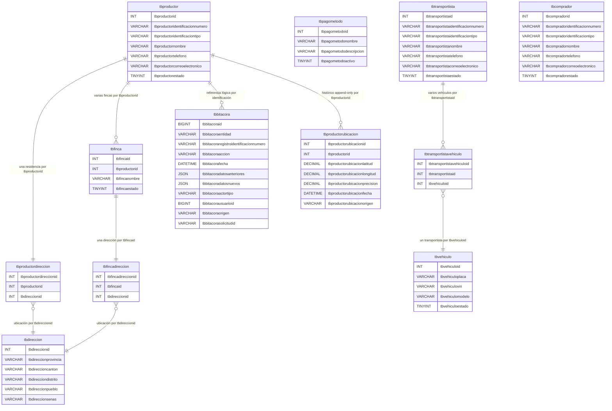

# DER - Modelo docente sin restricciones



## Cardinalidades conceptuales

```text
tbproductor 1 --- 1 tbproductordireccion N --- 1 tbdireccion
tbfinca     1 --- 1 tbfincadireccion     N --- 1 tbdireccion
tbproductor 1 --- N tbfinca
tbtransportista 1 --- N tbtransportistavehiculo N --- 1 tbvehiculo
```

`tbproductordireccion` y `tbfincadireccion` solo enlazan: ninguna guarda datos
de ubicación. Provincia, cantón, distrito, pueblo y señas existen una sola vez,
en `tbdireccion`.

`tbdireccion` no pertenece a productor ni a finca. Cuando la residencia del
productor y la ubicación de la finca son el mismo lugar físico,
`tbproductordireccion.tbdireccionid` y `tbfincadireccion.tbdireccionid` guardan
el mismo valor y la ubicación existe una sola vez:

```text
Caso A - lugares distintos          Caso B - mismo lugar
Productor -> tbdireccion 10         Productor -> tbdireccion 10
Finca     -> tbdireccion 11         Finca     -> tbdireccion 10
```

La relación productor - finca vive en `tbfinca.tbproductorid`; el avance no
introduce una tabla puente adicional porque la cardinalidad confirmada es
1 productor a N fincas.

`tbtransportistavehiculo` representa la asociación; la política de un solo
transportista por vehículo es documental, no física.

`tbpagometodo` es un catálogo aislado: el alcance vigente solo registra
`Efectivo` y todavía no se relaciona con operaciones económicas.

`tbproductorubicacion` registra cada lectura de ubicación GPS del productor
como una fila nueva: es append-only, ninguna fila se actualiza ni se elimina y
el histórico completo queda consultable por productor y por rango de fechas.
La relación con `tbproductor` es conceptual por `tbproductorid`, sin FK. No
confundir con `tbdireccion`: aquella es la residencia principal editable; esta
es la serie temporal de posiciones observadas.

## Atributos confirmados y atributos propuestos

| Entidad | Confirmado | Propuesto por modelado |
|---|---|---|
| `tbvehiculo` | placa, vin, modelo | `tbvehiculoestado`, por coherencia con el estado lógico del resto de tablas |
| `tbtransportista` | es una persona independiente, con identificador propio, y puede tener varios vehículos | identificación, tipo de identificación, nombre, teléfono, correo y estado, siguiendo el patrón de personas ya registrado en `tbproductor` y `tbcomprador` |

Los atributos propuestos no fueron solicitados: se modelaron para poder
identificar y contactar a la persona. Pueden retirarse si el dominio no los
necesita. Queda pendiente confirmar con el profesor cuáles son obligatorios.

Las líneas muestran asociaciones usadas por PHP, no restricciones de MySQL.
`tbcomprador` es independiente y todavía no participa en el CRUD de
productores.
El esquema define cero claves, restricciones, índices, valores `DEFAULT`,
`AUTO_INCREMENT` y objetos programables. PHP calcula cada identificador
mediante `MAX(id) + 1` bajo un bloqueo nombrado y envía todos los valores con
sentencias preparadas. Los campos `tbdireccionid`, `tbfincaid`,
`tbtransportistaid` y `tbvehiculoid` de las tablas de enlace son relaciones
conceptuales: el script no declara ninguna llave foránea.
