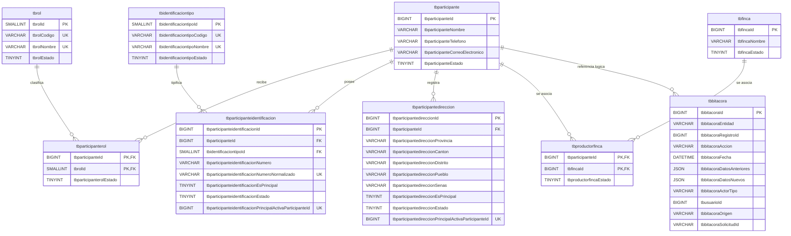

# Diagrama entidad-relación

Base de datos: `dbtindercows`.

## Claves y obligatoriedad

Todas las PK, FK, códigos, nombres de catálogo, estados y campos comunes del
participante son `NOT NULL`. Pueblo, señas, datos anteriores, datos nuevos y
`tbusuarioId` admiten `NULL`. Las columnas generadas de principal activa admiten
`NULL` deliberadamente para permitir varias filas no principales o inactivas.

Restricciones únicas compuestas o funcionales que Mermaid no expresa por
completo:

- `tbparticipanteidentificacion`: `UNIQUE
  (tbidentificaciontipoId, tbparticipanteidentificacionNumeroNormalizado)`.
- `tbparticipanteidentificacion`: la columna generada
  `tbparticipanteidentificacionPrincipalActivaParticipanteId` vale
  `tbparticipanteId` solo si la fila es principal y activa; su `UNIQUE` impide
  dos identificaciones principales activas para un participante.
- `tbparticipantedireccion`: la columna generada
  `tbparticipantedireccionPrincipalActivaParticipanteId` aplica la misma técnica
  para impedir dos direcciones principales activas.
- `tbparticipanterol`: PK compuesta `(tbparticipanteId, tbrolId)`.
- `tbproductorfinca`: PK compuesta `(tbparticipanteId, tbfincaId)`.

La existencia de exactamente una identificación y una dirección principal para
un participante activo no puede demostrarse solo con el índice: el controlador
la comprueba antes del `COMMIT`. El índice garantiza “como máximo una”; la
transacción garantiza “exactamente una” en las operaciones del CRUD.

## Cardinalidades y políticas

- Un participante puede tener varios roles; un rol puede pertenecer a varios
  participantes. Un productor es el participante activo con asignación activa
  al rol activo `PRODUCTOR`.
- Un participante puede tener varias identificaciones en el modelo, pero en este
  avance debe tener exactamente una principal activa.
- Un tipo de identificación clasifica muchas identificaciones.
- Un participante puede tener varias direcciones, con exactamente una principal
  activa mientras el participante esté activo.
- Productor y finca forman una asociación N:M. La relación no afirma propiedad.
- Una identificación inactiva continúa reservada por la restricción única.
- Desactivar al participante conserva roles, identificaciones, direcciones,
  fincas y bitácoras.

## Nota sobre la bitácora polimórfica

La línea entre `tbparticipante` y `tbbitacora` es lógica, no una FK física.
`tbbitacoraEntidad` indica la entidad y `tbbitacoraRegistroId` su identificador.
Ese diseño permite auditar distintas tablas con la misma estructura, pero MySQL
no puede imponer una FK única hacia destinos variables. En este avance se
registra la entidad `PARTICIPANTE`; el controlador conoce el registro afectado y
crea la bitácora dentro de la misma transacción. `tbusuarioId` tampoco tiene FK
porque `tbusuario` aún no existe.

## Correspondencia con scripts

| Parte | Archivo fuente |
|---|---|
| Base | `Database/SqlScripts/001_create_database.sql` |
| Catálogos | `Database/SqlScripts/002_create_catalogs.sql` |
| Participante, roles, identificación, dirección | `Database/SqlScripts/003_create_participante_schema.sql` |
| Fincas y asociación | `Database/SqlScripts/004_create_productor_finca.sql` |
| Bitácora | `Database/SqlScripts/005_create_audit.sql` |

